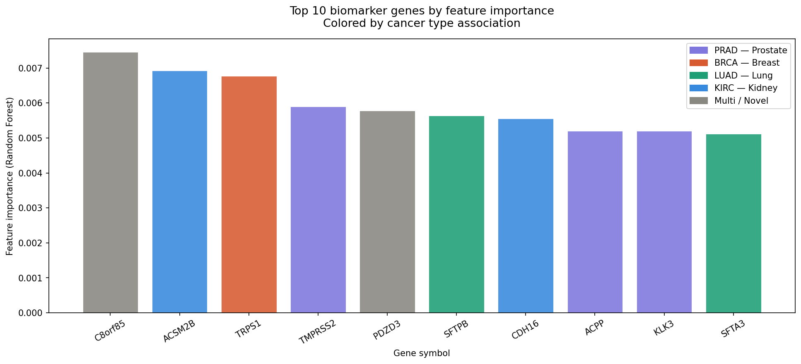

# Cancer Subtype Classification from RNA-Seq Data

A machine learning pipeline that classifies **five cancer subtypes** from high-dimensional RNA-Seq gene expression data and identifies biologically meaningful biomarker genes.

---

## Overview

Many cancers have subtypes that appear similar but respond differently to treatment. This project uses RNA-Seq gene expression data to:

* Classify 5 cancer types using machine learning
* Handle high-dimensional genomic data (20,000+ genes)
* Extract and interpret important genes (biomarkers)

The goal is not just prediction — but **biological insight**.

---

##  Dataset

* **Source:** UCI Machine Learning Repository
* **Dataset:** Gene Expression Cancer RNA-Seq

👉 Download:

* data.csv
* labels.csv
* genesID.csv

(Available on UCI / Kaggle)

**Dataset Summary:**

| Property | Value          |
| -------- | -------------- |
| Samples  | 801 patients   |
| Features | 20,531 genes   |
| Classes  | 5 cancer types |

Cancer types:

* BRCA (Breast)
* KIRC (Kidney)
* COAD (Colon)
* LUAD (Lung)
* PRAD (Prostate)

---

## ⚙️ Pipeline

1. **Preprocessing**

   * Remove zero-variance genes
   * Log transformation (`log1p`)
   * Standard scaling

2. **Visualization**

   * PCA (2D projection)

3. **Model**

   * Random Forest Classifier

4. **Interpretation**

   * Feature importance extraction
   * Gene ID → Symbol mapping

---

##  Results

* **Accuracy:** ~98%
* **Macro F1-score:** ~0.98

Key observations:

* Strong class separation in PCA
* Minimal misclassification
* Model identifies biologically relevant genes

---

##  Key Findings

* Model learns **tissue-specific signals**, not just generic cancer features

* Important genes include:

  * KLK3 (PSA) → Prostate cancer marker
  * TMPRSS2 → Known cancer driver
  * SFTPB / SFTA3 → Lung-specific genes

* Potential novel biomarker candidate discovered

---

##  Tech Stack

* Python
* Pandas, NumPy
* scikit-learn
* Matplotlib / Seaborn

---

## ⚡ Installation

git clone https://github.com/yourusername/cancer-rna-seq-classification.git
cd cancer-rna-seq-classification

python -m venv venv
source venv/bin/activate   (Mac/Linux)
venv\Scripts\activate      (Windows)

pip install -r requirements.txt

---

## Result 

##  References

* TCGA Pan-Cancer Project
* UCI ML Repository (Gene Expression Dataset)

---
